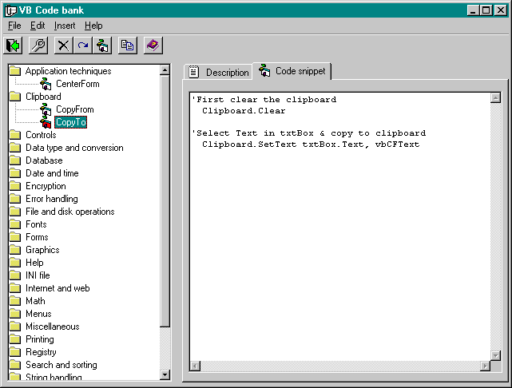

## Rick's Codebank

### Description

Rick's codebank is a simple application which, I believe, would be a good learning tool for beginners. When I was first starting out with VB it was nearly impossible to find a complete working project to learn from. Books and manuals talk all around a subject but never really show you how to do anything practical. They give you a few snippets of code, but never a project complete enough to give you the big picture.
 
### More Info
 
This is a complete application released into the public domain.

             |
---                |---
**Submitted On**   |2002-10-19 07:50:44
**By**             |[RxRick](https://github.com/Planet-Source-Code/PSCIndex/blob/master/ByAuthor/rxrick.md)
**Level**          |Beginner
**User Rating**    |4.7 (137 globes from 29 users)
**Compatibility**  |VB 6\.0
**Category**       |[Databases/ Data Access/ DAO/ ADO](https://github.com/Planet-Source-Code/PSCIndex/blob/master/ByCategory/databases-data-access-dao-ado__1-6.md)
**World**          |[Visual Basic](https://github.com/Planet-Source-Code/PSCIndex/blob/master/ByWorld/visual-basic.md)
**Archive File**   |[Rick's\_Cod1490871122002\.zip](https://github.com/Planet-Source-Code/rxrick-rick-s-codebank__1-40352/archive/master.zip)

